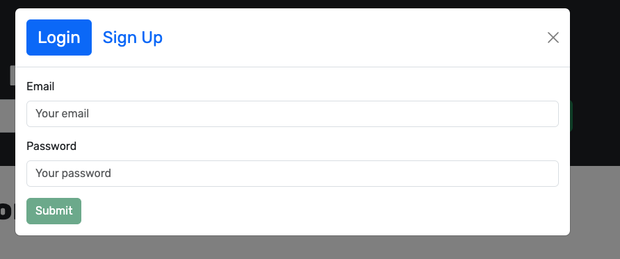
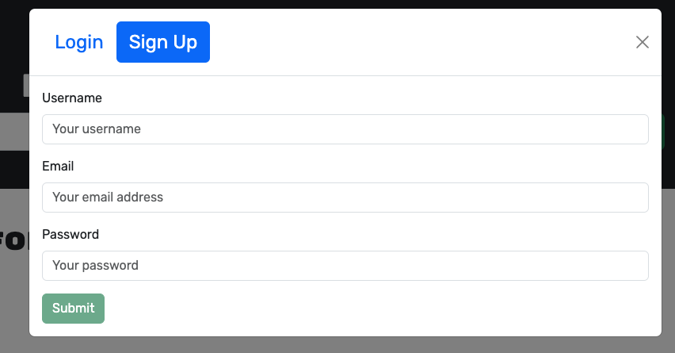
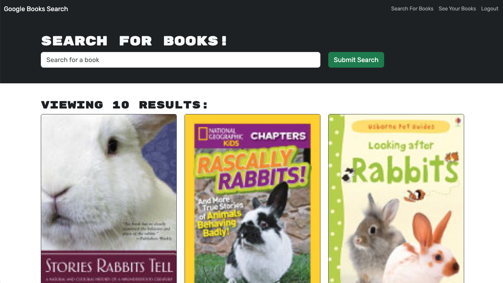
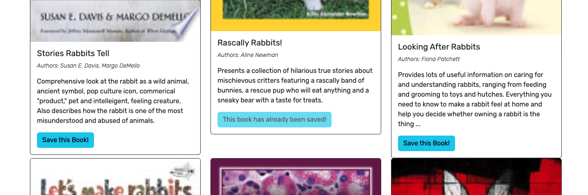
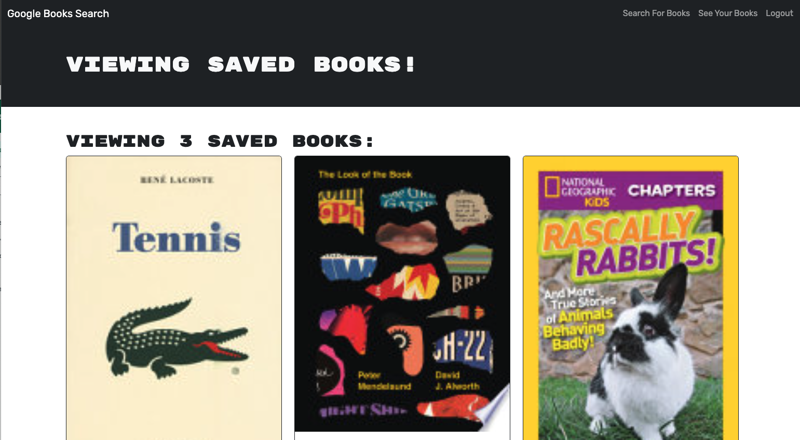
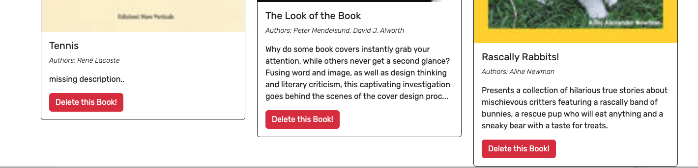

# Books To Read App

## Description

I refactor a googleBooks search engine that uses RESTful API into a GraphQL API with an Apollo Server

## Tech stack

- Node.js
- Express.js
- Apollo
- GraphQL
- MongoDB
- Mongose
- JWL
- React
- Boostrap

## Installation

<pre><code>npm run develop </code></pre>

## Test

Test by doing the following

- Search books under the Search for Books tab - notice no option to save books appears
- Sign up as a new user
- Log out
- Login with your credentials you used used
- Find for a book and not save it with the
  "save this book!" button
- Go to See Your Books tab, refresh and view your books saved, if you have read them already delete them and see how it will be deleted from your list

## Screenshots

## License

